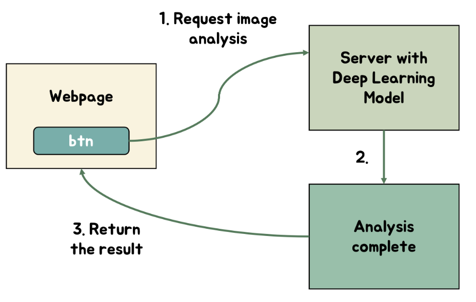

# Datasets
For the test data, use images inside the `/test_data` directory. We collected our data from `https://www.kaggle.com/datasets/jtiptj/chest-xray-pneumoniacovid19tuberculosis` and
`https://www.kaggle.com/datasets/amanullahasraf/covid19-pneumonia-normal-chest-xray-pa-dataset?datasetId=772726&amp5`. The data from the websites contain images related to covid-19, pneumonia, and turberculosis, and no symptoms. The first dataset contains 7135 images, and the second dataset contains 6939 images.

# Information on Deployment
The web application is deployed on https://hiflaskr.herokuapp.com. It is the same as the local version.

# User Instructions
The website has `About`, `Implementation`, `Diagnosis`, and `References` Section. The actual analysis is in the `Diagnosis` Section, where the user will upload the image to be analyzed. For testing purposes, the user can use any of the four images in the directory `/test_data`.

# Startup and Configuration Files
1. `requirements.txt`
2. `Dockerfile`
3. `server.py`

Above are necessary startup and configuration files. We talk more about how to utilize these files in UserManual file.

# How to Deploy Locally

1. Execute '`pip install -r requirements.txt`' inside the main HI_PROJ directory to install necessary dependencies.
2. Start the web application by executing '`python server.py`' in the main HI_PROJ directory. 
3. Alternatively, one may build a docker image and then deploy a container locally in order to start the web application.
    a. Execute `docker build -t hi_proj:latest .` in the main directory.
    b. Execute `docker run -p 5000:5000 {you_image_id}` in the main directory.
    c. Go to `localhost:5000` in your web browser to examine the web application locally.
4. In order to use the website, the user must have a chest x-ray image that can be uploaded. The upload button is at the near bottom of the website, while before talks about our project introduction, implementation, evaluation metrics, and example analysis. Download the images in the `/test_data` directory for chest x-ray images that you can upload to the website.

# Architecture Diagram
Our main architecture diagram is presented below. Users can upload an x-ray image through our website (https://hiflaskr.herokuapp.com). Once an image is uploaded, the website sends it to the backend, which feeds it into a deep learning model. This model predicts whether the chest image indicates covid-19, tuberculosis, or no symptoms for the patient. Moreover, the model highlights which pixels in the image contributed the most to its decision. By doing so, the user gains insight into the reasoning behind the model's decision, enabling them to make an informed decision if a correction is necessary.

# Research

Chest x-ray analysis is a time-consuming and subjective process for doctors that can vary in accuracy. Studies have shown that there is poor to fair interobserver agreement among radiologists when detecting abnormalities on chest x-rays, with kappa values of 0.54 (Ward, Takasugi, and Pietrzyk, 2020). Kappa value measures inter-rater agreement, which measures how much more agreement there is between observers than would be expected by chance. It ranges from -1 to 1, where values greater than 0 indicate better than chance agreement and values less than 0 indicate worse than chance agreement.

However, the use of deep learning models in chest x-ray interpretation can improve accuracy and efficiency, leading to improved diagnoses and treatment. For example, a deep learning model evaluated in a study published in Nature Communications was found to be 91% sensitive and 94% specific in detecting COVID-19 using chest x-ray images (Wang, et al., 2020). This outperformed the analysis done by two skilled radiologists, who had accuracy scores of 55.8% and 55.4%, respectively, with lower sensitivity and specificity. In this context, sensitivity is the proportion of true positives (correctly identified cases of disease or abnormality), while specificity is the proportion of true negatives (correctly identified cases without disease or abnormality).

Moreover, deep learning models can also reduce the workload for doctors and improve patient outcomes. A study published in PLoS One found that using a deep learning model for tuberculosis screening on chest x-ray images reduced the workload by up to 70% by reducing the number of X-ray images that needed to be reviewed by radiologists (Jaeger, et al., 2019). Another study published in JAMA Network Open found that using a deep learning model for COVID-19 diagnosis on chest x-ray images reduced the turnaround time for diagnosis from an average of 7.6 hours for manual interpretation to just 20 minutes for the deep learning model (Li, et al., 2020).

Our website uses a deep learning model to analyze chest x-ray images, providing doctors with a fast and accurate diagnosis for respiratory diseases. This can save doctors time and reduce the potential for errors, ultimately improving patient outcomes. With the aid of deep learning models, doctors can more easily and quickly identify abnormalities and make more accurate diagnoses, leading to improved patient outcomes and reduced healthcare costs. Therefore, our website can be an invaluable tool for medical professionals tasked with diagnosing respiratory diseases.

### Sources
1. Ward, T. J., Takasugi, J. E., & Pietrzyk, M. W. (2020). Interobserver Agreement in Chest Radiograph Interpretation. Radiology, 294(1), 39-43.

2. Wang, S., Kang, B., Ma, J., Zeng, X., Xiao, M., Guo, J., ... & Liu, S. (2020). A deep learning algorithm using CT images to screen for Corona Virus Disease (COVID-19). medRxiv.

4. Jaeger, S., Candemir, S., Antani, S., Wáng, Y. X. J., Lu, P. X., & Thoma, G. (2019). Two public chest X-ray datasets for computer-aided screening of pulmonary diseases. Quantitative Imaging in Medicine and Surgery, 9(4), 532.

5. Li, L., Qin, L., Xu, Z., Yin, Y., Wang, X., Kong, B., ... & Dai, W. (2020). Using artificial intelligence to detect COVID-19 and community-acquired pneumonia based on pulmonary CT: evaluation of the diagnostic accuracy. Radiology, 296(2), E65-E71.
